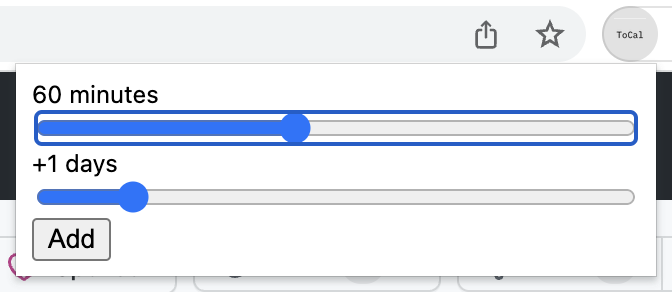

# tocal-chrome

A companion Chrome extension to https://github.com/ul/tocal.
Which it calls via https://github.com/alexherbo2/chrome-shell.
You'll need to install `chrome-shell` separately and register this extension id with it.
Path to ToCal script is configurable in extension settings.

